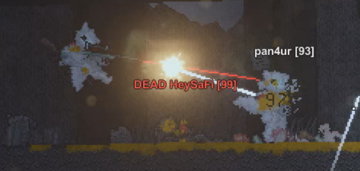
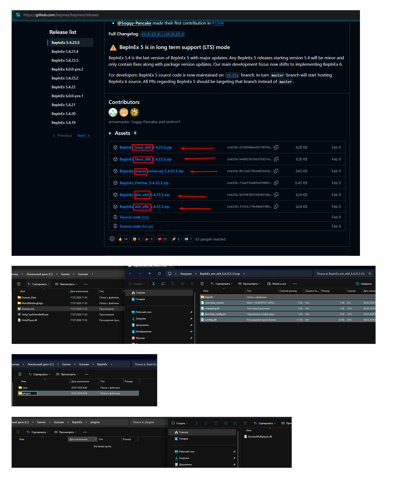
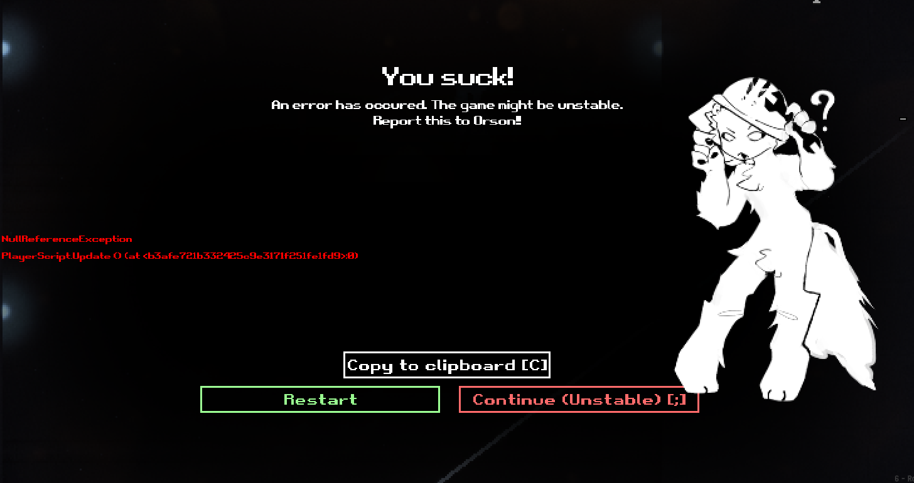

# Gunsaw Multiplayer Mod

> **WIP, IN-DEV — not production-ready. (overall, it's already playable)**  This is an unofficial multiplayer mod for
> [Gunsaw](https://orsonik.itch.io/gunsaw-demo). It is actively being developed and
> can contain desyncs, crashes, incomplete mechanics, and compatibility issues



## Current development features

- Public lobby list, lobby creation, joining, and in-game chat
- Multiplayer settings for PvP, grabbing players, and respawning
- Replication of players, weapons, many world props, NPCs, and selected map hazards
- Host-to-client custom level transfer

## TODO

### Net
- [x] Switch to UDP
- [X] Reduce the packet rate (send movement and pose packets only when changed for stationary entities)
- [X] Improve packet serialization (implement string hashing or short id) to reduce packet size
- [X] Optimize far objects, keep them on the map but disable ticking
- [ ] Fix Hello handshake (it doesn't always work and crashes the lobby sometimes)

### Sync Fixes
- [x] Far objects sync
- [X] Fix shooting randomization desync
- [X] Fix barrel fire desync
- [X] Fix NPC shooting tracers not being visible to other players
- [X] Fix pallet desync when breaking into two parts
- [X] Fix dead entity body state (e.g., closed eyes) mismatch with host
- [X] Fix ammo indicator desync on weapons dropped by killed entities (blinks on host, doesn't show on clients)
- [X] Sync bullet hit effects
- [X] Add interp
- [ ] Make sure there are definitely no desyncs and crashes

### Gameplay
- [X] Fix avatar
- [ ] Fix tails
- [X] Fix destruction of lightbulbs from hits
- [X] Fix weapon dropping at the beginning of the game
- [ ] Fix or disable the process of transferring into another body
- [ ] Add teams
- [ ] Add colored respawn points
- [ ] Real gameplay test

### UI
- [X] Improve MP Window
- [ ] Add more MP settings and features

### Architecture
- [ ] Refactor god classes
- [X] Fix compatibility with CrossOver on Apple Silicon
- [ ] Reduce the load on the server's CPU
 
## Installation

1. Download [Gunsaw](https://orsonik.itch.io/gunsaw-demo/purchase)
2. Extract the game to C:\Games\Gunsaw (or another folder)
3. Start the unmodified game once, then close it
4. Install [BepInEx](https://github.com/bepinex/bepinex/releases) into the game folder — the folder that contains the
   `Gunsaw.exe`
5. Download `GunsawMultiplayer.dll` from releases
6. Copy the `GunsawMultiplayer.dll` to ```<Gunsaw folder>\BepInEx\plugins\GunsawMultiplayer.dll```
7. Start Gunsaw, open the **Multiplayer** menu at bottom-left corner, and create or join a lobby
8. Smash your friends in every way possible



The mod currently uses a default lobby server. Idk how long it will stay online, but you can host your own lobby server by setting its IP address and following the instructions below

## Custom levels

1. Create and export a level in Gunsaw's level editor
2. Host a multiplayer lobby
3. In the multiplayer window, choose **Paste custom level**. The exported level code must be
   in the clipboard
4. Confirm that the status says the level is loaded, then choose **Start custom level**

## Crashes

You'll most likely encounter crashes. If you see this window, please copy the error message and open an issue describing what you were doing before the crash occurred



## Building the mod

You need the .NET SDK and a local Gunsaw installation whose required managed assemblies are
available in `GunsawMultiplayer/lib/`. For the standard local installation, the source DLLs are located in `Gunsaw\BepInEx\core\` and `Gunsaw\Gunsaw_Data\Managed\`. Copy `BepInEx.dll` and `0Harmony.dll` from the `BepInEx\core` directory, and `Assembly-CSharp.dll` together with the required `UnityEngine*.dll` files from the `Gunsaw_Data\Managed` directory into `GunsawMultiplayer\lib\`. These game DLLs are not included in the repository and must be obtained from your own Gunsaw installation.

```powershell
.\build-mod.ps1
```

## Running your own lobby server

The relay/lobby service lives in [LobbyServer](https://github.com/Pan4ur/Gunsaw-Lobby-Server)

## Contributing

Pull requests are very welcome

## Credits

- [Orsoniks](https://github.com/Orsoniks) for **Gunsaw**
- [BepInEx team](https://github.com/BepInEx) for [BepInEx](https://github.com/BepInEx/BepInEx) and [HarmonyX](https://github.com/BepInEx/HarmonyX)
- [OpenAI](https://github.com/OPENAI) for **GPT 5.6 Sol**

## Disclaimer

This is a community-made, unofficial modification. It is not affiliated with, endorsed by,
or supported by Orsoniks or the developers of Gunsaw. This repository does not claim ownership
of Gunsaw, its characters, assets, code, or any other original-game rights. You must obtain
Gunsaw from its official source before using this mod
