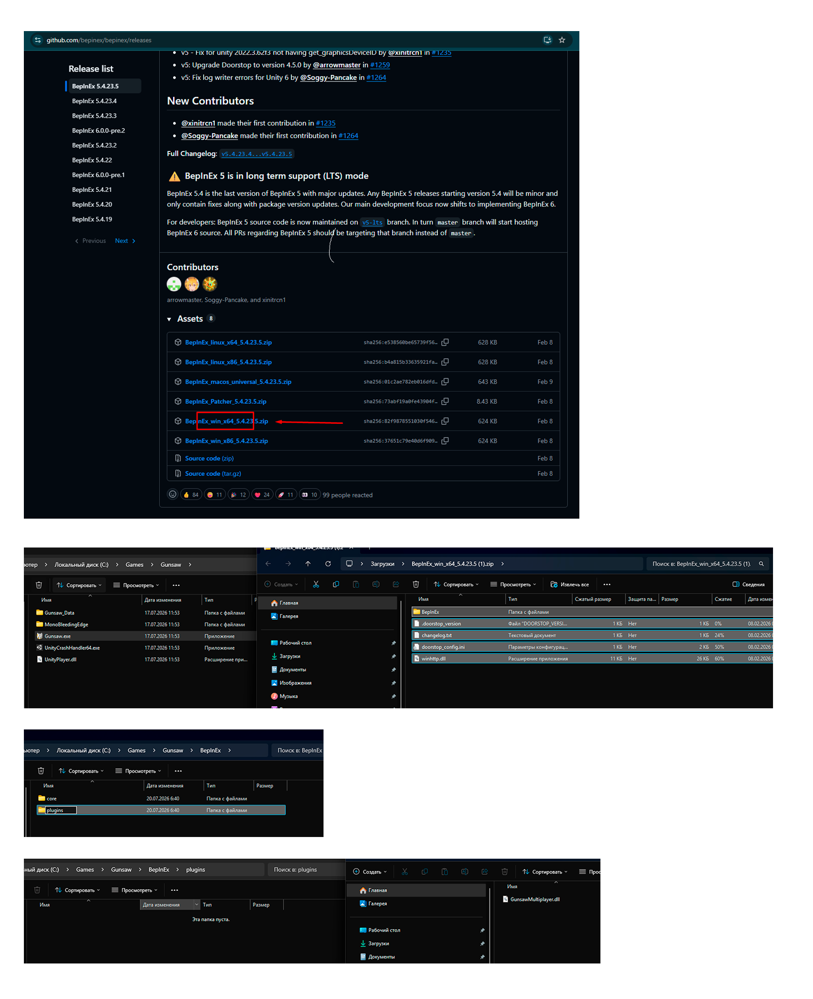
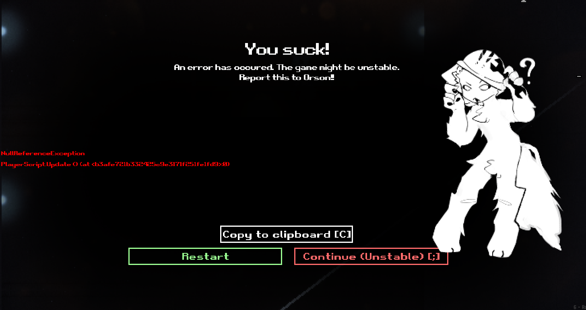

# Gunsaw Multiplayer Mod

> This is an unofficial multiplayer mod for [Gunsaw](https://orsonik.itch.io/gunsaw-demo). It is actively being developed and
> can contain desyncs, crashes, incomplete mechanics, and compatibility issues

I only recently learned that another multiplayer project for Gunsaw has been in development, and until then I had no idea it existed. I sincerely wish you the best with your project and hope it continues to grow. My goal is simply to contribute to the community by providing a multiplayer experience and a platform for creating and testing custom maps and ideas :)


https://youtu.be/aYmxX_OQOis

MP Features:

- Multiplayer for up to 16 players
- PVP and CO-OP modes
- Text chat
- Player nametags and off-screen teammate markers
- Configurable respawning
- Player-to-player collisions can be enabled or disabled
- Multiplayer scoreboard with kills, deaths, accuracy, headshots and ranks
- Mission MVP and multiplayer leaderboard
- Host-controlled cheats and multiplayer settings
- When a player dies, they either respawn or enter spectator mode
- Players can grab each other with the gravity laser
- Players can carry each other
- Players can ride in the same vehicle
- Players can change their character with /swap
- Players can change their size with /scale
- /tp teleports you to another player in CO-OP
- /spawn returns you to the map spawn point
- The Host can ban players with /ban
- Custom levels are automatically transferred from the Host to clients
- A new NPC Spawner object is available in the level editor
- P2P and Relay connection modes
- Discord RPC

## Installation

1. Download [Gunsaw](https://orsonik.itch.io/gunsaw-demo/purchase)
2. Extract the game to C:\Games\Gunsaw (or another folder)
3. Start the unmodified game once, then close it
4. Install [BepInEx](https://github.com/bepinex/bepinex/releases) into the game folder — the folder that contains the `Gunsaw.exe`
5. Download `GunsawMultiplayer.dll` from releases
6. Copy the `GunsawMultiplayer.dll` to ```<Gunsaw folder>\BepInEx\plugins\GunsawMultiplayer.dll```
7. Start Gunsaw, open the **Multiplayer** menu at bottom-left corner, and create or join a lobby
8. Smash your friends in every way possible

<details>
<summary>Detailed</summary>
      

      
</details>

## Custom levels

1. Create and export a level in Gunsaw's level editor or copy it [here](https://gunsaw-level-codes.jimmyking.dev/)
2. Host a multiplayer lobby
3. In the multiplayer window, choose **Paste**. The exported level code must be
   in the clipboard
4. Confirm that the status says the level is loaded, then choose **Start**

## Default binds

- ENTER - Open chat
- TAB - Open player list
- C - Carry player (You need to aim at him with your sights)
- E - Reactivate one-time triggers

### Debug binds
- END + SPACE + S - Net/CPU profiler
- END + SPACE + R - Sleeping objects debug
- END + SPACE + C + S - CS Expierience

## Crashes

You'll most likely encounter crashes. If you see this window, please copy the error message and open an issue describing what you were doing before the crash occurred



## Building the mod

You need the .NET SDK and a local Gunsaw installation whose required managed assemblies are
available in `GunsawMultiplayer/lib/`. For the standard local installation, the source DLLs are located in `Gunsaw\BepInEx\core\` and `Gunsaw\Gunsaw_Data\Managed\`. Copy `BepInEx.dll` and `0Harmony.dll` from the `BepInEx\core` directory, and `Assembly-CSharp.dll` together with the required `UnityEngine*.dll` files from the `Gunsaw_Data\Managed` directory into `GunsawMultiplayer\lib\`. These game DLLs are not included in the repository and must be obtained from your own Gunsaw installation.

```powershell
dotnet build .\GunsawMultiplayer.csproj -c Release
```

## Running your own lobby server

The relay/lobby service lives in [LobbyServer](https://github.com/Pan4ur/Gunsaw-Lobby-Server)

## Headless mode

This mode launches Gunsaw without graphics in minimized mode. As a result, GPU usage drops to zero and RAM usage decreases slightly. This is necessary for hosting a lobby 24/7, for example, on a VPS. Players can also manage the lobby through voting

Open a terminal in the game directory and run Gunsaw.exe with the required arguments:

```powershell
.\Gunsaw.exe -batchmode -nographics -headlessLobby -headlessMap ".\default_map.txt" -logFile - --master "https://gunsawudp.e621.su" --name "HEADLESS LOBBY" --host "HOST" --max-players 16 --pvp --can-grab --allow-respawn --respawn-seconds 5 --respawn-at-start 2>&1 | Tee-Object -FilePath ".\headless.log"
```

CTRL + C to stop

### Startup args

- -headlessMap <path> - File with a code for custom map
- -logFile <path> - File used for server logs

### Lobby args

- --master <url> - Address of the master server
- --name <name> - Lobby name
- --host <name> - "Host" name
- --max-players <count> - Max lobby size
- --respawn-seconds <seconds> - Respawn delay
- --pvp - Enables pvp
- --can-grab - Allows players to grab other players
- --grab-only-unconscious - Disables the ability to grab conscious players
- --allow-respawn - Allows respawning
- --respawn-at-start - You'll respawn at the spawn point. If you don't include this argument, you'll respawn at the location where you died (or near other players if you were crushed and have nowhere else to respawn), and the random respawn point feature won't work

### Chat commands

- !tps - Displays server statistics
- !vote restart - Voting for level restart
- !vote change <level name> - Voting for level change. Works with built in <campaign1, actualLevel1, ...> and from [gunsaw-level-codes](gunsaw-level-codes) <Foundry, Leapy jump - CART trials, ...>
- !votedefault - Voting for load level from headlessMap file
- !help - Displays all commands

## Contributing

Pull requests are very welcome

## Credits

- [Orsoniks](https://github.com/Orsoniks) for **Gunsaw**
- [BepInEx team](https://github.com/BepInEx) for [BepInEx](https://github.com/BepInEx/BepInEx), [HarmonyX](https://github.com/BepInEx/HarmonyX) and [AssemblyPublicizer](https://github.com/BepInEx/BepInEx.AssemblyPublicizer)
- [OpenAI](https://github.com/OPENAI) for **GPT 5.6 Sol**
- [Rushell](https://github.com/rushellxyz) & Sturnn - for contributions to testing and development
- [Jimmyking](https://github.com/jimmyking9999999) for [gunsaw-level-codes](https://gunsaw-level-codes.jimmyking.dev/)

## Disclaimer

This is a community-made, unofficial modification. It is not affiliated with, endorsed by,
or supported by Orsoniks or the developers of Gunsaw. This repository does not claim ownership
of Gunsaw, its characters, assets, code, or any other original-game rights. You must obtain
Gunsaw from its official source before using this mod
